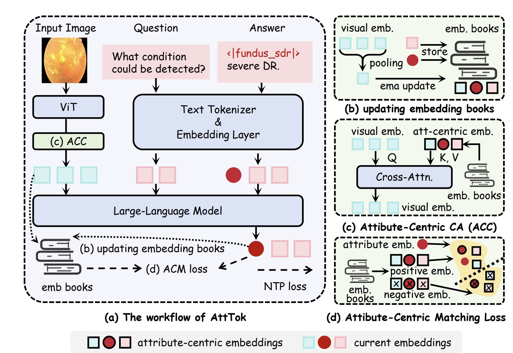

## 📚 ATTTOK: MARRYING ATTRIBUTE TOKENS WITH GENERATIVE PRE-TRAINED VISION-LANGUAGE MODELS TOWARDS MEDICAL IMAGE UNDERSTANDING (ICLR 26)





## 📝 Citation

```bibtex
@inproceedings{
wang2026atttok,
title={AttTok: Marrying Attribute Tokens with Generative Pre-trained Vision-Language Models towards Medical Image Understanding},
author={Hualiang Wang and Xinyue Xu and Lehan Wang and Bin Pu and Xiaomeng Li},
booktitle={The Fourteenth International Conference on Learning Representations},
year={2026},
url={https://openreview.net/forum?id=UjSoF5CM09}
}
```

## 🙏 Code Acknowledgments

During the development of this project, we were inspired and supported by the following outstanding open-source projects, and we would like to express our sincere gratitude to them: [Qwen-VL-Series-Finetune](https://github.com/2U1/Qwen-VL-Series-Finetune), [transformers](https://github.com/huggingface/transformers), and [LlamaFactory](https://github.com/hiyouga/LlamaFactory)


